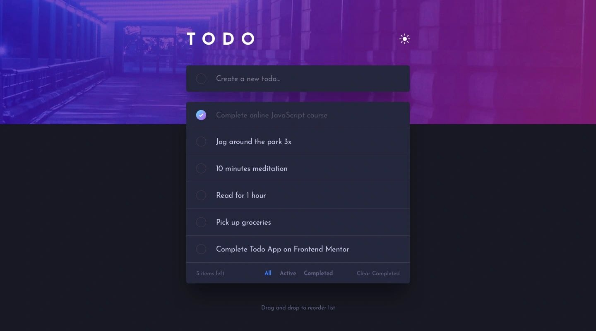

# The Ultimate Todo List APP



## What is this all about?

This is a simple todo app built with NextJS for practice the design is from FrontEnd Mentor.

You can write a todo and check it for completion and remove it from the list or edit.

All the todos are saved in the local storage so if you want to close the website and open it again you can see all the todos saved for you.

## Application

To look at the website you can visit this link: [The Ultimate Todo](https://todo-app-with-next-js-nine.vercel.app/)

You can Run the application locally.
all you need is clone the repository on your local machine
make sure you have NodeJS (v21.6.2 recommended) installed.

And in the file path in your local device open your terminal and run this commands.

```bash
# For a development environment
  npm install # to install all the dependencies
  npm run dev # will start a development environment build

# for a production environment
  npm install # to install all the dependencies
  npm run build # will build the application
  npm run start # will start a production environment
```
